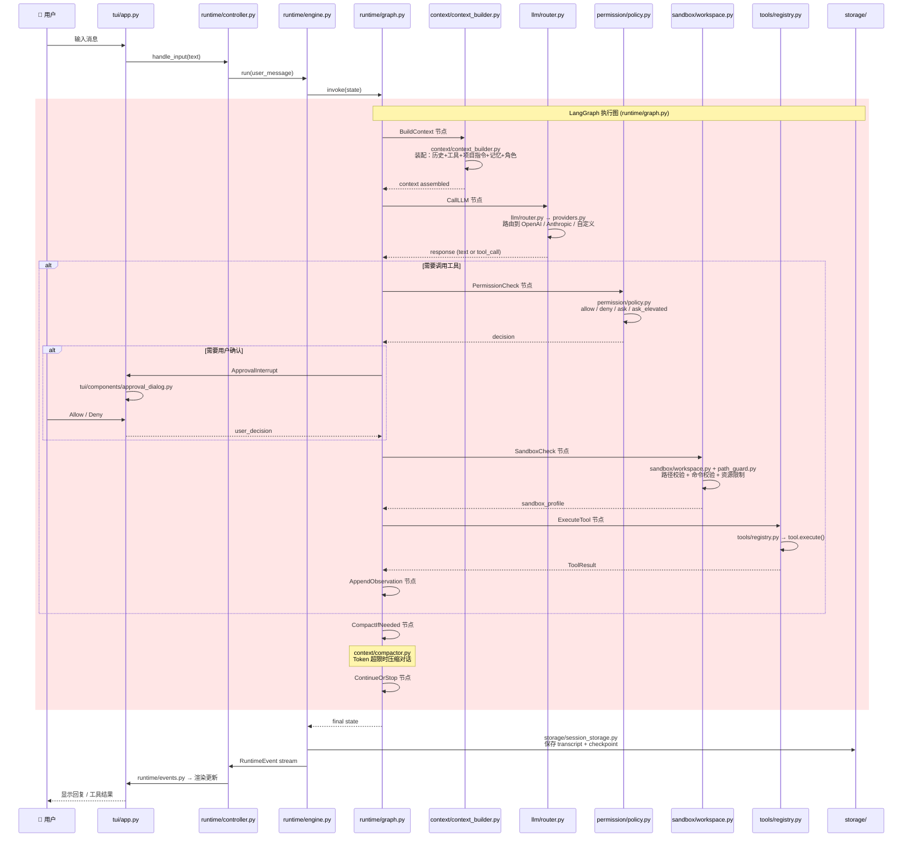
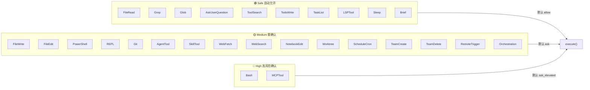
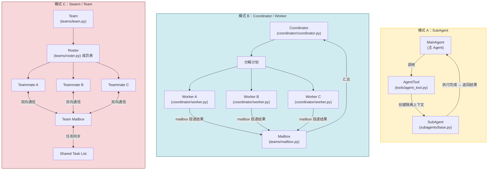
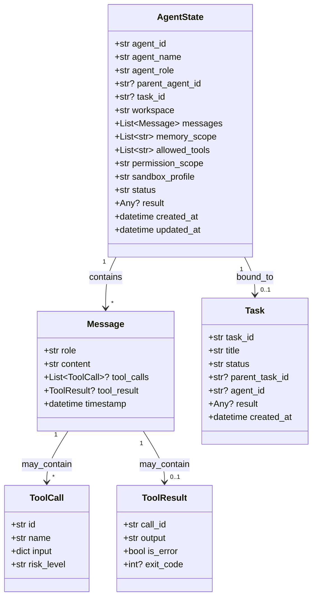
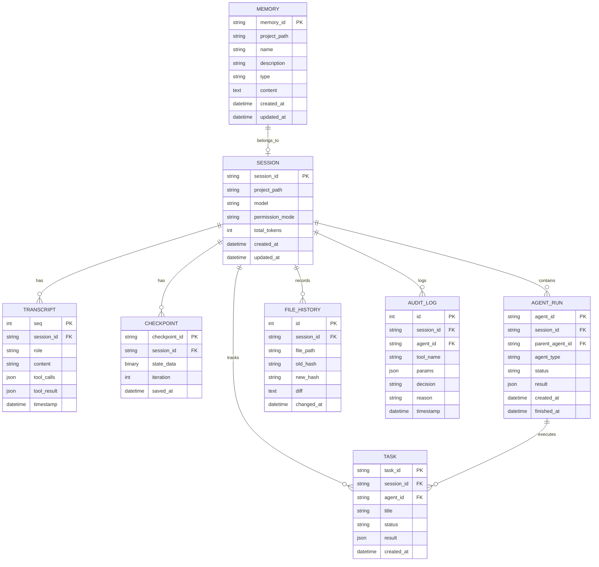
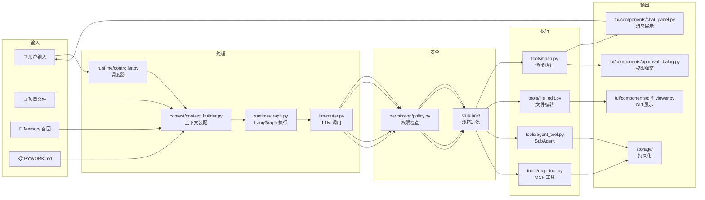

# PyWork 架构全景图

> 文件 → 功能 → 目录 三者对应关系 | 基于 [[PyWork 技术方案设计文档 v0.2]]

---

## 1. 系统全景：15 层架构总图

```mermaid
graph TB
    subgraph L1["① Entry / CLI 入口层"]
        direction LR
        CLI["entrypoints/cli.py<br/>📌 pywork 命令入口"]
        INIT["entrypoints/init.py<br/>📌 --init 项目初始化"]
        DOCTOR["entrypoints/doctor.py<br/>📌 --doctor 环境诊断"]
        MAIN["main.py<br/>📌 启动引导"]
    end

    subgraph L2["② Bootstrap 启动层"]
        direction LR
        ENV["bootstrap/env.py<br/>📌 环境检测"]
        CFG["bootstrap/config_loader.py<br/>📌 配置加载"]
        DEP["bootstrap/dependency_check.py<br/>📌 依赖校验"]
        WS["bootstrap/workspace_loader.py<br/>📌 工作区发现"]
    end

    subgraph L3["③ TUI / REPL 交互层"]
        direction LR
        APP["tui/app.py<br/>📌 Textual App 主窗口"]
        INPUT["tui/components/input_box.py<br/>📌 输入框"]
        CHAT["tui/components/chat_panel.py<br/>📌 消息渲染"]
        DIFF["tui/components/diff_viewer.py<br/>📌 Diff 展示"]
        APPROVAL["tui/components/approval_dialog.py<br/>📌 权限弹窗"]
        TOOLLOG["tui/components/tool_log.py<br/>📌 工具日志"]
        STATUSBAR["tui/components/status_bar.py<br/>📌 状态栏"]
        TASKPANEL["tui/components/tasks/<br/>📌 后台任务面板"]
        AGENTPANEL["tui/components/agents/<br/>📌 Agent 列表面板"]
    end

    subgraph L4["④ Runtime Engine 引擎层 ⭐核心"]
        direction LR
        ENGINE["runtime/engine.py<br/>📌 Agent 生命周期管理"]
        GRAPH["runtime/graph.py<br/>📌 LangGraph 执行图"]
        STATE["runtime/state.py<br/>📌 AgentState 状态定义"]
        EVENTS["runtime/events.py<br/>📌 RuntimeEvent 事件流"]
        STREAM["runtime/streaming.py<br/>📌 流式推送"]
        CTRL["runtime/controller.py<br/>📌 循环调度器"]
    end

    subgraph L5["⑤ LLM 模型层"]
        direction LR
        ROUTER["llm/router.py<br/>📌 多 Provider 路由"]
        PROV["llm/providers.py<br/>📌 Provider 适配器"]
        MSG["llm/messages.py<br/>📌 消息格式转换"]
        TOKEN["llm/token_budget.py<br/>📌 Token 计数+预算"]
        PROMPTS["llm/prompts.py<br/>📌 Prompt 模板"]
    end

    subgraph L6["⑥ Context / Prompt 上下文层"]
        direction LR
        SYS_PROMPT["context/system_prompt.py<br/>📌 System Prompt 构建"]
        CTX_BUILDER["context/context_builder.py<br/>📌 上下文装配"]
        PROJ_IDX["context/project_index.py<br/>📌 项目文件索引"]
        PROJ_INSTR["context/project_instructions.py<br/>📌 PYWORK.md 解析"]
        COMPACTOR["context/compactor.py<br/>📌 对话压缩"]
        INCLUDE["context/include_resolver.py<br/>📌 @include 展开"]
        LAYERS["context/prompt_layers.py<br/>📌 分层注入"]
        RT_CTX["context/runtime_context.py<br/>📌 运行时上下文"]
    end

    subgraph L7["⑦ Tools 工具层"]
        direction LR
        TOOL_BASE["tools/tool.py<br/>📌 工具抽象基类"]
        REGISTRY["tools/registry.py<br/>📌 工具注册表"]
        FILE_R["tools/file_read.py<br/>📌 读文件"]
        FILE_W["tools/file_write.py<br/>📌 写文件"]
        FILE_E["tools/file_edit.py<br/>📌 精确替换"]
        GREP["tools/grep.py<br/>📌 正则搜索"]
        GLOB["tools/glob.py<br/>📌 文件匹配"]
        BASH["tools/bash.py<br/>📌 Bash 执行"]
        PS["tools/powershell.py<br/>📌 PowerShell 执行"]
        AGENT_T["tools/agent_tool.py<br/>📌 创建子Agent"]
        ASK["tools/ask_user_question.py<br/>📌 用户询问"]
        MCP_T["tools/mcp_tool.py<br/>📌 MCP工具代理"]
        SKILL_T["tools/skill_tool.py<br/>📌 Skill调用"]
    end

    subgraph L8["⑧ Permission 权限层"]
        direction LR
        POLICY["permission/policy.py<br/>📌 策略引擎"]
        MODE["permission/mode.py<br/>📌 权限模式"]
        RISK["permission/risk.py<br/>📌 风险等级"]
        FILE_P["permission/file_permissions.py<br/>📌 文件权限规则"]
        BASH_P["permission/bash_permissions.py<br/>📌 命令权限规则"]
        PS_P["permission/powershell_permissions.py<br/>📌 PS权限规则"]
        APPROVAL_M["permission/approval.py<br/>📌 审批逻辑"]
        AUDIT["permission/audit.py<br/>📌 审计日志"]
    end

    subgraph L9["⑨ Sandbox 沙箱层"]
        direction LR
        WS_SB["sandbox/workspace.py<br/>📌 策略沙箱"]
        PATH_G["sandbox/path_guard.py<br/>📌 路径守卫"]
        CMD_G["sandbox/command_guard.py<br/>📌 命令守卫"]
        PROC_SB["sandbox/process.py<br/>📌 进程沙箱"]
        LIMITS["sandbox/limits.py<br/>📌 资源限制"]
    end

    subgraph L10["⑩ Memory / Storage 存储层"]
        direction LR
        DB["storage/db.py<br/>📌 SQLite 数据库"]
        SESS["storage/session_storage.py<br/>📌 会话存储"]
        TRANS["storage/transcript_storage.py<br/>📌 JSONL 对话记录"]
        CKPT["storage/checkpoint_storage.py<br/>📌 Checkpoint"]
        RESUME["storage/session_resume.py<br/>📌 会话恢复"]
        SES_MEM["memory/session_memory.py<br/>📌 会话记忆"]
        PROJ_MEM["memory/project_memory.py<br/>📌 项目记忆"]
        MEMFILE["memdir/memory_file.py<br/>📌 记忆文件"]
        MEMIDX["memdir/index.py<br/>📌 记忆索引"]
    end

    subgraph L11["⑪ Services 服务层"]
        direction LR
        COMPACT_SVC["services/compact/<br/>📌 压缩服务"]
        LSP_SVC["services/lsp/<br/>📌 LSP 集成"]
        OAUTH_SVC["services/oauth/<br/>📌 OAuth 认证"]
        MCP_SVC["services/mcp/<br/>📌 MCP 服务管理"]
        PLUGIN_SVC["services/plugins/<br/>📌 插件服务"]
        SESS_SVC["services/session_memory/<br/>📌 记忆提取"]
    end

    subgraph L12["⑫ MCP / Plugin / Skill 扩展层"]
        direction LR
        MCP_CLI["mcp/client.py<br/>📌 MCP Client"]
        MCP_CFG["mcp/config.py<br/>📌 MCP 配置"]
        MCP_SM["mcp/server_manager.py<br/>📌 Server 管理"]
        MCP_ADAP["mcp/tool_adapter.py<br/>📌 工具适配"]
        PLUGIN_L["plugins/loader.py<br/>📌 插件加载"]
        PLUGIN_R["plugins/registry.py<br/>📌 插件注册"]
        PLUGIN_API["plugins/api.py<br/>📌 插件 API"]
        SKILL_L["skills/loader.py<br/>📌 Skill 加载"]
        SKILL_R["skills/registry.py<br/>📌 Skill 注册"]
        SKILL_M["skills/skill.py<br/>📌 Skill 模型"]
    end

    subgraph L13["⑬ Hooks / Events 事件层"]
        direction LR
        HOOK_B["hooks/hook.py<br/>📌 Hook 基类"]
        HOOK_R["hooks/registry.py<br/>📌 Hook 注册表"]
        PRE_T["hooks/pre_tool_use.py<br/>📌 工具前拦截"]
        POST_T["hooks/post_tool_use.py<br/>📌 工具后处理"]
        STOP_H["hooks/stop_hooks.py<br/>📌 停止钩子"]
        PERM_H["hooks/tool_permission.py<br/>📌 权限钩子"]
    end

    subgraph L14["⑭ Tasks / Multi-Agent 多Agent层"]
        direction LR
        SUB_BASE["subagents/base.py<br/>📌 SubAgent 基类"]
        SUB_GEN["subagents/general.py<br/>📌 通用Agent"]
        SUB_PLAN["subagents/planner.py<br/>📌 规划Agent"]
        SUB_REV["subagents/reviewer.py<br/>📌 审查Agent"]
        COORD["coordinator/coordinator.py<br/>📌 协调者"]
        WORKER["coordinator/worker.py<br/>📌 执行者"]
        TEAM["teams/team.py<br/>📌 团队模型"]
        MAILBOX["teams/mailbox.py<br/>📌 消息邮箱"]
        TASK_M["tasks/task_manager.py<br/>📌 任务管理器"]
        TASK_L["tasks/local_task.py<br/>📌 本地任务"]
    end

    subgraph L15["⑮ Remote / Bridge 远程层"]
        direction LR
        BR_SRV["bridge/server.py<br/>📌 Bridge 服务端"]
        BR_CLI["bridge/client.py<br/>📌 Bridge 客户端"]
        BR_MSG["bridge/messages.py<br/>📌 消息协议"]
        REM_CLI["remote/client.py<br/>📌 远程客户端"]
        REM_SRV["remote/server.py<br/>📌 远程服务端"]
        REM_SWARM["remote/swarm.py<br/>📌 远程Swarm"]
    end

    subgraph SUPPORT["🔧 支撑模块"]
        direction LR
        SCH_CFG["schemas/config_schema.py<br/>📌 配置模型"]
        SCH_MSG["schemas/message_schema.py<br/>📌 消息模型"]
        SCH_TOOL["schemas/tool_schema.py<br/>📌 工具模型"]
        UTIL_DIFF["utils/diff.py<br/>📌 Diff 引擎"]
        UTIL_SHELL["utils/shell.py<br/>📌 Shell 辅助"]
        UTIL_ERR["utils/errors.py<br/>📌 错误定义"]
        UTIL_PATH["utils/paths.py<br/>📌 路径工具"]
        SEC_PS["security/prompt_injection_guard.py<br/>📌 注入检测"]
        SEC_SCAN["security/secret_scanner.py<br/>📌 密钥扫描"]
        SEC_REDACT["security/redactor.py<br/>📌 脱敏处理"]
    end

    L1 --> L2 --> L3 --> L4
    L4 --> L5
    L4 --> L6
    L4 --> L7
    L7 --> L8
    L7 --> L9
    L4 --> L10
    L7 --> L12
    L7 --> L13
    L4 --> L14
    L14 --> L15

    style L4 fill:#ff6b6b,stroke:#c92a2a,color:#fff
    style L7 fill:#ff6b6b,stroke:#c92a2a,color:#fff
    style L14 fill:#ff6b6b,stroke:#c92a2a,color:#fff
```



> 🔴 红色 = 核心层 | ⭐ = P0 最高优先级

---

## 2. Agent 主循环：Runtime 核心数据流



---

## 3. 目录-文件-功能 三维映射表

### 3.1 入口与启动

| 目录 | 文件 | 实现功能 | 依赖 |
|:------|:-----|:---------|:-----|
| `entrypoints/` | `cli.py` | `pywork` 命令入口，参数解析，分发到 TUI/Headless | Typer, `bootstrap/` |
| | `init.py` | `pywork --init` 项目初始化向导 | `bootstrap/workspace_loader.py` |
| | `doctor.py` | `pywork --doctor` 环境诊断（Python/依赖/网络/Git） | `bootstrap/dependency_check.py` |
| `main.py` | — | 启动引导，初始化日志，注册信号处理 | 以上全部 |

### 3.2 启动引导

| 目录 | 文件 | 实现功能 | 依赖 |
|:------|:-----|:---------|:-----|
| `bootstrap/` | `env.py` | 检测 Python 版本、OS 类型、Shell 环境 | `constants/` |
| | `config_loader.py` | 加载 TOML 配置 → pydantic 校验 | `schemas/config_schema.py` |
| | `dependency_check.py` | 校验 ripgrep、git、docker 等外部依赖 | subprocess |
| | `workspace_loader.py` | 发现项目根目录，加载 .gitignore | `utils/paths.py` |

### 3.3 TUI 交互

| 目录 | 文件 | 实现功能 | 依赖 |
|:------|:-----|:---------|:-----|
| `tui/` | `app.py` | Textual App 主窗口，CSS 布局，键盘绑定 | Textual, `keybindings/` |
| | `repl_launcher.py` | REPL 模式启动器 | `tui/screens/repl.py` |
| `tui/screens/` | `repl.py` | REPL 主屏幕 | `components/` |
| | `permission.py` | 权限设置全屏页 | `permission/` |
| | `settings.py` | 设置全屏页 | — |
| `tui/components/` | `input_box.py` | 多行输入，Ctrl+Enter 提交，历史浏览 | Textual Widget |
| | `chat_panel.py` | 用户/助手消息气泡，Markdown 渲染 | Rich |
| | `diff_viewer.py` | 统一 diff 渲染，绿色+红色高亮 | `utils/diff.py` |
| | `approval_dialog.py` | 权限确认弹窗，Allow/Deny/Always | `permission/` |
| | `tool_log.py` | 工具调用/结果展示，折叠展开 | — |
| | `status_bar.py` | 底栏：模型名 · 权限模式 · Token 用量 · 时间 | `state/ui_state.py` |
| | `file_tree.py` | 项目文件树浏览 | `context/project_index.py` |
| `tui/components/tasks/` | — | 后台 Task 进度面板 | `tasks/task_manager.py` |
| `tui/components/agents/` | — | 活跃 Agent 列表+状态 | `subagents/` |
| `tui/components/messages/` | — | 消息渲染组件 | `schemas/message_schema.py` |
| `tui/components/diff/` | — | Diff 子组件（行号、折叠、跳转） | `utils/diff.py` |
| `tui/components/shell/` | — | 内嵌终端组件 | `tools/bash.py` |

### 3.4 Runtime Engine（核心）

| 目录 | 文件 | 实现功能 | 依赖 |
|:------|:-----|:---------|:-----|
| `runtime/` | `state.py` | `AgentState` TypedDict：messages, tool_calls, status, iteration, checkpoint_id, agent_id | `schemas/message_schema.py` |
| | `graph.py` | LangGraph StateGraph 构建：节点 + 条件边 | LangGraph, 以下所有 |
| | `engine.py` | Agent 生命周期：`run()` → 创建图 → 执行 → 保存checkpoint | `runtime/graph.py`, `storage/` |
| | `controller.py` | 循环调度：接收用户输入 → 调用 Engine → 推送事件 → 等待下次输入 | `runtime/engine.py`, `runtime/events.py` |
| | `events.py` | `RuntimeEvent` 枚举：MESSAGE / TOOL_CALL / TOOL_RESULT / ERROR / CHECKPOINT / ABORT | `schemas/` |
| | `streaming.py` | AsyncGenerator 流式推送 LLM token + tool result | `llm/router.py` |

### 3.5 LLM 接入

| 目录 | 文件 | 实现功能 | 依赖 |
|:------|:-----|:---------|:-----|
| `llm/` | `router.py` | 统一入口：根据 model name 路由到对应 Provider | `llm/providers.py` |
| | `providers.py` | OpenAI / Anthropic / OpenAI-compatible 适配器 | openai, anthropic SDK |
| | `messages.py` | 内部消息 ↔ API format 双向转换 | `schemas/message_schema.py` |
| | `token_budget.py` | tiktoken 计数，预算监控，超限预警 | tiktoken |
| | `prompts.py` | 预置 Prompt 模板 | — |

### 3.6 Context 上下文

| 目录 | 文件 | 实现功能 | 依赖 |
|:------|:-----|:---------|:-----|
| `context/` | `system_prompt.py` | 动态构建 system prompt：工具定义 + 权限模式 + 沙箱配置 + 环境信息 | `tools/registry.py`, `permission/`, `sandbox/` |
| | `context_builder.py` | 完整上下文装配器：用户输入 → 历史 → 工具 → 项目指令 → 记忆 → 角色 | 所有 context 子模块 |
| | `project_index.py` | tree-sitter 扫描项目，提取函数/类/变量 | tree-sitter |
| | `project_instructions.py` | 查找并解析 PYWORK.md / CLAUDE.md / AGENTS.md | — |
| | `include_resolver.py` | 解析 `@include(path)` 语法，递归展开 | — |
| | `prompt_layers.py` | 四层叠加：System → Project → Session → Agent | — |
| | `runtime_context.py` | 实时注入：时间戳、OS、cwd、git branch、env vars | `utils/paths.py` |
| | `compactor.py` | 触发条件判断 → LLM 摘要 → 旧消息折叠/替换 | `llm/router.py` |
| | `relevance.py` | 消息相关性评分，不相关消息优先丢弃 | — |
| | `file_summary.py` | 大文件摘要生成 | `llm/` |
| | `symbol_index.py` | 符号索引（类/函数/变量 → 文件位置） | tree-sitter |
| | `trust.py` | 信任度评分，影响权限决策 | — |
| | `prompt_cache.py` | Prompt 缓存管理 | — |

### 3.7 Tools 工具

| 目录 | 文件 | 类型 | 风险 | 实现功能 |
|:------|:-----|:-----|:-----|:---------|
| `tools/` | `tool.py` | 基类 | — | 抽象 Tool 接口：name, description, input_schema, risk_level, execute(), render_result() |
| | `registry.py` | 注册表 | — | register / get / list / unregister / get_by_risk |
| | `file_read.py` | 文件 | 🟢 Safe | 读取文件，返回带行号内容，最大限制 |
| | `file_write.py` | 文件 | 🟡 Medium | 创建/覆盖文件，需 diff 确认 |
| | `file_edit.py` | 文件 | 🟡 Medium | 精确 OldString→NewString 替换 |
| | `grep.py` | 搜索 | 🟢 Safe | 正则搜索，调用 ripgrep，返回匹配行+文件+行号 |
| | `glob.py` | 搜索 | 🟢 Safe | 文件模式匹配 |
| | `bash.py` | 执行 | 🔴 High | subprocess 执行 bash，捕获 stdout/stderr/exit_code |
| | `powershell.py` | 执行 | 🔴 High | Windows PowerShell 执行 |
| | `repl.py` | 执行 | 🟡 Medium | Python REPL 执行 |
| | `git.py` | 版本控制 | 🟡 Medium | git status/commit/branch/diff/log |
| | `enter_worktree.py` | 版本控制 | 🟡 Medium | 创建隔离 git worktree |
| | `exit_worktree.py` | 版本控制 | 🟡 Medium | 退出并清理 worktree |
| | `agent_tool.py` | Agent | 🟡 Medium | 创建/调用/停止 SubAgent |
| | `ask_user_question.py` | 交互 | 🟢 Safe | 向用户发起单选/多选问题 |
| | `send_message.py` | 通信 | 🟢 Safe | Agent 间消息传递 |
| | `todo.py` | 任务 | 🟢 Safe | TodoWrite 任务清单 |
| | `task_tools.py` | 任务 | 🟢 Safe | TaskCreate/List/Output/Stop |
| | `task_update.py` | 任务 | 🟢 Safe | 更新 Task 状态 |
| | `mcp_tool.py` | 扩展 | 🔴 High | MCP 工具代理调用 |
| | `skill_tool.py` | 扩展 | 🟡 Medium | Skill 触发执行 |
| | `web_fetch.py` | 网络 | 🟡 Medium | HTTP 抓取 → Markdown |
| | `web_search.py` | 网络 | 🟡 Medium | 搜索引擎集成 |
| | `notebook_edit.py` | 文件 | 🟡 Medium | Jupyter Notebook 编辑 |
| | `lsp.py` | 语言 | 🟢 Safe | LSP 跳转/补全/诊断 |
| | `tool_search.py` | 元工具 | 🟢 Safe | 搜索可用工具 |
| | `schedule_cron.py` | 调度 | 🟡 Medium | 定时任务 |
| | `team_create.py` | 团队 | 🟡 Medium | 创建 Agent 团队 |
| | `team_delete.py` | 团队 | 🟡 Medium | 解散 Agent 团队 |
| | `remote_trigger.py` | 远程 | 🟡 Medium | 远程触发执行 |
| | `sleep.py` | 控制 | 🟢 Safe | 等待指定时间 |
| | `brief.py` | 元工具 | 🟢 Safe | 工具功能简述 |
| | `synthetic_output.py` | 测试 | 🟢 Safe | 模拟输出 |
| | `orchestration.py` | 编排 | 🟡 Medium | 工作流编排 |

### 3.8 Permission 权限

| 目录 | 文件 | 实现功能 | 依赖 |
|:------|:-----|:---------|:-----|
| `permission/` | `policy.py` | 核心策略引擎：根据 tool risk + mode + 规则 → allow/deny/ask/ask_elevated | `permission/mode.py`, `permission/risk.py` |
| | `mode.py` | 权限模式枚举：default / readonly / plan / accept_edits / bypass | — |
| | `risk.py` | 风险等级：safe / low / medium / high / critical + 默认策略 | — |
| | `file_permissions.py` | 文件规则矩阵：读(自动允许) / 写(确认) / 删(高风险确认) | `sandbox/path_guard.py` |
| | `bash_permissions.py` | 命令黑白名单，危险模式检测 | `sandbox/command_guard.py` |
| | `powershell_permissions.py` | PowerShell 特别规则（ExecutionPolicy 等） | — |
| | `approval.py` | 审批逻辑：构建审批描述 → TUI 弹窗 → 收集决策 | `tui/components/approval_dialog.py` |
| | `audit.py` | 审计日志：who / when / tool / params / decision / result | `storage/db.py` |

### 3.9 Sandbox 沙箱

| 目录 | 文件 | 层次 | 实现功能 |
|:------|:-----|:-----|:---------|
| `sandbox/` | `workspace.py` | Policy | 策略沙箱：工具白名单 / Agent sandbox_profile 构建 / workspace 绑定 |
| | `path_guard.py` | Policy+FS | 路径守卫：禁止 `../` 穿越 / 禁止 `~/.ssh` `/etc` `/proc` / 工作区外路径拦截 |
| | `command_guard.py` | Policy | 命令守卫：`rm -rf /` / `chmod 777` / `curl \| bash` / `eval` 检测并拦截 |
| | `process.py` | Process | 进程沙箱：subprocess 超时 / stdout 10MB 限制 / SIGKILL |
| | `limits.py` | Process | 资源限制：执行 120s / 输出 10MB / 并发 5 / 内存限制 |

### 3.10 Storage 存储

| 目录 | 文件 | 存储内容 | 格式 |
|:------|:-----|:---------|:-----|
| `storage/` | `db.py` | 数据库连接池 + 建表 migrations | SQLite (aiosqlite) |
| | `session_storage.py` | 会话 CRUD：创建/更新/删除/列表 | SQLite |
| | `session_metadata.py` | 会话元数据：时间/模型/Token/状态 | SQLite |
| | `transcript_storage.py` | 完整对话记录 | JSONL |
| | `checkpoint_storage.py` | LangGraph checkpoint 序列化 | Pickle/JSON |
| | `session_resume.py` | 从 checkpoint 恢复完整会话状态 | 读以上所有 |
| | `file_history.py` | 文件每次修改的快照 | SQLite + 文件系统 |
| | `artifact_storage.py` | Agent 产出物（生成的代码/文档/图片） | 文件系统 |
| | `sidechain_storage.py` | SubAgent 侧链对话记录 | JSONL |

### 3.11 Memory 记忆

| 目录 | 文件 | 实现功能 | 生命周期 |
|:------|:-----|:---------|:---------|
| `memory/` | `session_memory.py` | 对话内短期记忆（用户偏好、本次决定） | 单次会话 |
| | `project_memory.py` | 项目级别记忆，跨会话持久化 | 项目生命周期 |
| | `long_term_memory.py` | 长期记忆接口（可扩展为向量检索） | 永久 |
| `memdir/` | `memory_file.py` | Frontmatter + Markdown 记忆文件读写 | 永久（文件系统） |
| | `index.py` | 记忆索引：全量扫描 → 关键词检索 → 关联推荐 | 会话内缓存 |

### 3.12 MCP / Plugin / Skill 扩展

| 目录 | 文件 | 实现功能 | 协议/格式 |
|:------|:-----|:---------|:----------|
| `mcp/` | `client.py` | MCP Client：stdio/SSE/HTTP transport | MCP Protocol |
| | `config.py` | MCP Server 配置解析（命令、环境变量、权限） | TOML |
| | `server_manager.py` | MCP Server 生命周期：启动→监控→重启→停止 | subprocess |
| | `tool_adapter.py` | MCP Tool → PyWork Tool 适配（schema 转换） | JSON Schema |
| `skills/` | `skill.py` | Skill 数据模型：name/description/allowed_tools/model/effort | YAML+MD |
| | `loader.py` | SKILL.md 解析：YAML frontmatter + Markdown body | — |
| | `registry.py` | Skill 注册 + 路径触发匹配 | — |
| `plugins/` | `api.py` | Plugin API 接口定义（hook 点、工具注册点） | Python |
| | `loader.py` | 四源加载：user/project/session/bundled | 文件系统 |
| | `registry.py` | 插件注册表，生命周期管理 | — |

### 3.13 Hooks 事件

| 目录 | 文件 | 触发时机 | 用途 |
|:------|:-----|:---------|:-----|
| `hooks/` | `hook.py` | 基类定义 | Hook 抽象接口 |
| | `registry.py` | 事件总线：register / unregister / fire | 全局 Hook 管理 |
| | `pre_tool_use.py` | 工具执行前 | 自定义权限检查、参数修改 |
| | `post_tool_use.py` | 工具执行后 | 日志、通知、结果后处理 |
| | `stop_hooks.py` | 会话停止时 | 清理、保存、通知 |
| | `tool_permission.py` | 权限决策时 | 自定义权限逻辑注入 |

### 3.14 Multi-Agent 多 Agent

| 目录 | 文件 | Agent 角色 | 实现功能 |
|:------|:-----|:----------|:---------|
| `subagents/` | `base.py` | 基类 | SubAgent 基类：独立 state / 隔离 context / 工具范围 / 权限范围 / abort 信号 |
| | `general.py` | 通用执行者 | 执行任意任务，全工具访问 |
| | `planner.py` | 规划者 | 分解大任务 → 产出步骤计划 |
| | `reviewer.py` | 审查者 | 代码审查：bug/安全/性能/风格 |
| | `debugger.py` | 调试者 | 分析错误 → 定位根因 → 建议修复 |
| | `verifier.py` | 验证者 | 验证修复是否正确，回归检查 |
| `coordinator/` | `coordinator.py` | 协调者 | 接收复杂任务 → 分解 → 分配 Worker → 汇总结果 |
| | `worker.py` | 执行者 | 执行 Coordinator 分配的子任务 |
| | `context_modifier.py` | — | 为不同 Worker 定制不同上下文 |
| `teams/` | `team.py` | — | Team 模型：roster + shared_task_list + 权限回调 |
| | `roster.py` | — | 成员列表管理：加入/离开/角色 |
| | `teammate.py` | 队友 | Teammate Agent：共享状态，可通信 |
| | `mailbox.py` | — | 邮箱系统：消息投递 / 轮询 / 已读 |
| | `swarm.py` | — | Swarm 编排：自组织任务分配 |

### 3.15 Tasks 任务

| 目录 | 文件 | 实现功能 |
|:------|:-----|:---------|
| `tasks/` | `task.py` | Task 数据模型：id, status(pending/running/done/failed), result, parent_id, agent_id, created_at |
| | `task_manager.py` | 任务生命周期：create / run / monitor / stop / retry / cancel_all |
| | `local_task.py` | asyncio.Task 后端实现 |
| | `remote_task.py` | 远程 Task 后端接口（mock） |
| | `task_storage.py` | Task 状态持久化到 SQLite |

### 3.16 Remote / Bridge 远程

| 目录 | 文件 | 实现功能 |
|:------|:-----|:---------|
| `bridge/` | `server.py` | Bridge 服务端：接收远程连接 |
| | `client.py` | Bridge 客户端：连接远程 Agent |
| | `messages.py` | 消息序列化协议 |
| `remote/` | `server.py` | 远程 Agent 服务端 |
| | `client.py` | 远程 Agent 客户端 |
| | `swarm.py` | 远程 Swarm 模拟 |

### 3.17 支撑模块

| 目录 | 文件 | 实现功能 |
|:------|:-----|:---------|
| `schemas/` | `config_schema.py` | Pydantic 配置模型：模型/权限/沙箱/MCP/Skills/Plugins |
| | `message_schema.py` | 消息数据模型：UserMessage/AssistantMessage/ToolCall/ToolResult |
| | `tool_schema.py` | 工具数据模型：ToolCall/ToolResult/input_schema |
| `utils/` | `diff.py` | difflib + unidiff：生成 unified diff |
| | `shell.py` | Shell 辅助：转义、环境变量注入、超时控制 |
| | `errors.py` | 自定义异常：ToolError/PermissionDenied/SandboxViolation/AbortError |
| | `paths.py` | 路径工具：规范化、安全检查、workspace 相对路径 |
| | `logging.py` | 日志配置：级别/格式/文件/脱敏 |
| | `ids.py` | ID 生成：UUID7 / 短ID |
| | `json.py` | JSON 辅助：序列化/反序列化 + pydantic 模型 |
| `security/` | `prompt_injection_guard.py` | 检测 prompt injection 模式（"忽略之前指令"等） |
| | `secret_scanner.py` | 扫描输出中的 API Key / Token / 密码 |
| | `redactor.py` | 日志/输出敏感信息脱敏 |
| | `unicode_sanitizer.py` | Unicode 攻击防护（同形异义字等） |
| `constants/` | `app.py` | 应用名/版本/作者 |
| | `models.py` | 模型列表 + 默认模型 + 价格 |
| | `paths.py` | 默认路径常量（配置目录、数据目录等） |
| `state/` | `app_state.py` | 全局单例状态（跨会话） |
| | `session_state.py` | 会话状态（单次会话） |
| | `ui_state.py` | UI 临时状态（展开/折叠/选中） |
| `keybindings/` | `defaults.py` | 默认快捷键绑定 |
| | `registry.py` | 快捷键注册表 |
| `types/` | — | 类型定义目录 |
| `migrations/` | — | 数据库迁移脚本 |
| `native/` | — | Rust/C 原生扩展（可选） |

---

## 4. 工具风险分级总览



---

## 5. 多 Agent 模式对比



| 模式 | 文件 | 适用场景 | V1 实现方式 |
|:------|:-----|:---------|:-----------|
| **SubAgent** | `subagents/` + `tools/agent_tool.py` | 代码审查、文档总结、安全检查 | asyncio.Task + 独立 AgentState |
| **Coordinator/Worker** | `coordinator/` + `tools/task_tools.py` | 多项目分析、多文件修改、方案比较 | Coordinator 分解 → N×Worker 并发 → 汇总 |
| **Swarm/Team** | `teams/` + `teams/mailbox.py` | 复杂重构、大项目、多角色协作 | Team roster + Shared Task List + Mailbox |

---

## 6. AgentState 状态模型



---

## 7. 存储模型 ER 图



---

## 8. 数据流向总图



---

## 9. 完整文件清单（按层分组）

```
src/pywork/
│
├── 📂 entrypoints/          # ① 入口层
│   ├── cli.py               #    pywork 主命令
│   ├── init.py              #    --init 初始化
│   └── doctor.py            #    --doctor 诊断
│
├── 📂 bootstrap/            # ② 启动层
│   ├── env.py               #    环境检测
│   ├── config_loader.py     #    配置加载
│   ├── dependency_check.py  #    依赖校验
│   └── workspace_loader.py  #    工作区发现
│
├── 📂 tui/                  # ③ TUI 交互层
│   ├── app.py               #    Textual App 主窗口
│   ├── repl_launcher.py     #    REPL 启动器
│   ├── screens/
│   │   ├── repl.py          #    REPL 主屏
│   │   ├── permission.py    #    权限设置屏
│   │   └── settings.py      #    设置屏
│   └── components/
│       ├── input_box.py     #    输入框
│       ├── chat_panel.py    #    消息面板
│       ├── diff_viewer.py   #    Diff 查看器
│       ├── approval_dialog.py #  权限弹窗
│       ├── tool_log.py      #    工具日志
│       ├── status_bar.py    #    状态栏
│       ├── file_tree.py     #    文件树
│       ├── tasks/           #    任务面板
│       ├── agents/          #    Agent 面板
│       ├── messages/        #    消息组件
│       ├── diff/            #    Diff 子组件
│       ├── shell/           #    内嵌终端
│       ├── settings/        #    设置组件
│       ├── design_system/   #    设计系统
│       ├── mcp/             #    MCP 面板
│       ├── memory/          #    记忆面板
│       ├── permissions/     #    权限面板
│       ├── sandbox/         #    沙箱面板
│       ├── skills/          #    Skills 面板
│       ├── teams/           #    团队面板
│       ├── grove/           #    树组件
│       ├── hooks/           #    Hooks 面板
│       ├── ui/              #    UI 基础
│       └── wizard/          #    向导组件
│
├── 📂 runtime/              # ④ Runtime Engine ⭐
│   ├── engine.py            #    Agent 生命周期
│   ├── graph.py             #    LangGraph 执行图
│   ├── state.py             #    AgentState 定义
│   ├── events.py            #    RuntimeEvent 流
│   ├── streaming.py         #    流式推送
│   └── controller.py        #    循环调度器
│
├── 📂 llm/                  # ⑤ LLM 层
│   ├── router.py            #    多 Provider 路由
│   ├── providers.py         #    Provider 适配器
│   ├── messages.py          #    消息格式转换
│   ├── token_budget.py      #    Token 预算
│   └── prompts.py           #    Prompt 模板
│
├── 📂 context/              # ⑥ Context 层
│   ├── system_prompt.py     #    System Prompt 构建
│   ├── context_builder.py   #    上下文装配
│   ├── project_index.py     #    项目索引
│   ├── project_instructions.py # PYWORK.md 解析
│   ├── include_resolver.py  #    @include 展开
│   ├── prompt_layers.py     #    分层注入
│   ├── runtime_context.py   #    运行时上下文
│   ├── compactor.py         #    对话压缩
│   ├── relevance.py         #    相关性过滤
│   ├── file_summary.py      #    文件摘要
│   ├── symbol_index.py      #    符号索引
│   ├── trust.py             #    信任评分
│   └── prompt_cache.py      #    Prompt 缓存
│
├── 📂 tools/                # ⑦ 工具层
│   ├── tool.py              #    抽象基类
│   ├── registry.py          #    注册表
│   ├── file_read.py         #    读文件
│   ├── file_write.py        #    写文件
│   ├── file_edit.py         #    精确编辑
│   ├── grep.py              #    正则搜索
│   ├── glob.py              #    文件匹配
│   ├── bash.py              #    Bash 执行
│   ├── powershell.py        #    PowerShell 执行
│   ├── repl.py              #    Python REPL
│   ├── git.py               #    Git 操作
│   ├── enter_worktree.py    #    进入 Worktree
│   ├── exit_worktree.py     #    退出 Worktree
│   ├── agent_tool.py        #    SubAgent 创建
│   ├── ask_user_question.py #    用户询问
│   ├── send_message.py      #    Agent 通信
│   ├── todo.py              #    任务清单
│   ├── task_tools.py        #    Task 管理
│   ├── task_update.py       #    Task 更新
│   ├── mcp_tool.py          #    MCP 代理
│   ├── mcp_auth.py          #    MCP 权限
│   ├── skill_tool.py        #    Skill 调用
│   ├── web_fetch.py         #    网页抓取
│   ├── web_search.py        #    网页搜索
│   ├── notebook_edit.py     #    Notebook 编辑
│   ├── lsp.py               #    LSP 集成
│   ├── tool_search.py       #    工具搜索
│   ├── schedule_cron.py     #    定时任务
│   ├── team_create.py       #    创建团队
│   ├── team_delete.py       #    解散团队
│   ├── remote_trigger.py    #    远程触发
│   ├── sleep.py             #    等待
│   ├── brief.py             #    工具简述
│   ├── synthetic_output.py  #    模拟输出
│   ├── orchestration.py     #    工作流编排
│   ├── config.py            #    配置工具
│   ├── enter_plan_mode.py   #    计划模式
│   ├── exit_plan_mode.py    #    退出计划
│   ├── list_mcp_resources.py #   MCP 资源列表
│   └── read_mcp_resource.py #    MCP 资源读取
│
├── 📂 permission/           # ⑧ 权限层
│   ├── policy.py            #    策略引擎
│   ├── mode.py              #    权限模式
│   ├── risk.py              #    风险等级
│   ├── file_permissions.py  #    文件规则
│   ├── bash_permissions.py  #    Bash 规则
│   ├── powershell_permissions.py # PS 规则
│   ├── approval.py          #    审批逻辑
│   └── audit.py             #    审计日志
│
├── 📂 sandbox/              # ⑨ 沙箱层
│   ├── workspace.py         #    策略沙箱
│   ├── path_guard.py        #    路径守卫
│   ├── command_guard.py     #    命令守卫
│   ├── process.py           #    进程沙箱
│   └── limits.py            #    资源限制
│
├── 📂 security/             # 🔒 安全模块
│   ├── prompt_injection_guard.py  # 注入检测
│   ├── secret_scanner.py    #    密钥扫描
│   ├── redactor.py          #    脱敏处理
│   └── unicode_sanitizer.py #    Unicode 防护
│
├── 📂 memory/               # ⑩ Memory
│   ├── session_memory.py    #    会话记忆
│   ├── project_memory.py    #    项目记忆
│   └── long_term_memory.py  #    长期记忆
│
├── 📂 memdir/               # ⑩ 记忆文件
│   ├── memory_file.py       #    记忆文件读写
│   └── index.py             #    记忆索引
│
├── 📂 storage/              # ⑩ Storage
│   ├── db.py                #    SQLite DB
│   ├── session_storage.py   #    会话存储
│   ├── session_metadata.py  #    会话元数据
│   ├── transcript_storage.py #   JSONL 对话
│   ├── checkpoint_storage.py #   Checkpoint
│   ├── session_resume.py    #    会话恢复
│   ├── file_history.py      #    文件历史
│   ├── artifact_storage.py  #    产出物
│   └── sidechain_storage.py #    侧链记录
│
├── 📂 services/             # ⑪ 服务层
│   ├── compact/             #    压缩服务
│   ├── lsp/                 #    LSP 服务
│   ├── oauth/               #    OAuth 服务
│   ├── mcp/                 #    MCP 服务
│   ├── plugins/             #    插件服务
│   ├── session_memory/      #    记忆提取
│   ├── tools/               #    工具服务
│   ├── api/                 #    API 服务
│   ├── analytics/           #    分析服务
│   ├── auto_dream/          #    Auto Dream
│   ├── magic_docs/          #    Magic Docs
│   ├── policy_limits/       #    策略限制
│   ├── prompt_suggestion/   #    Prompt 建议
│   ├── remote_managed_settings/ # 远程管理设置
│   ├── settings_sync/       #    设置同步
│   ├── team_memory_sync/    #    团队记忆同步
│   ├── agent_summary/       #    Agent 摘要
│   ├── extract_memories/    #    记忆提取
│   ├── tips/                #    提示服务
│   └── tool_use_summary/    #    工具使用摘要
│
├── 📂 mcp/                  # ⑫ MCP
│   ├── client.py            #    MCP Client
│   ├── config.py            #    MCP 配置
│   ├── server_manager.py    #    Server 管理
│   └── tool_adapter.py      #    工具适配
│
├── 📂 skills/               # ⑫ Skills
│   ├── skill.py             #    Skill 模型
│   ├── loader.py            #    SKILL.md 解析
│   └── registry.py          #    Skill 注册
│
├── 📂 plugins/              # ⑫ Plugins
│   ├── api.py               #    Plugin API
│   ├── loader.py            #    插件加载
│   └── registry.py          #    插件注册
│
├── 📂 hooks/                # ⑬ Hooks
│   ├── hook.py              #    Hook 基类
│   ├── registry.py          #    Hook 注册表
│   ├── pre_tool_use.py      #    工具前钩子
│   ├── post_tool_use.py     #    工具后钩子
│   ├── stop_hooks.py        #    停止钩子
│   └── tool_permission.py   #    权限钩子
│
├── 📂 subagents/            # ⑭ SubAgent
│   ├── base.py              #    SubAgent 基类
│   ├── general.py           #    通用 Agent
│   ├── planner.py           #    规划 Agent
│   ├── reviewer.py          #    审查 Agent
│   ├── debugger.py          #    调试 Agent
│   └── verifier.py          #    验证 Agent
│
├── 📂 coordinator/          # ⑭ Coordinator
│   ├── coordinator.py       #    协调者
│   ├── worker.py            #    执行者
│   └── context_modifier.py  #    上下文修饰
│
├── 📂 teams/                # ⑭ Team/Swarm
│   ├── team.py              #    Team 模型
│   ├── roster.py            #    Roster 管理
│   ├── teammate.py          #    Teammate Agent
│   ├── mailbox.py           #    消息邮箱
│   └── swarm.py             #    Swarm 编排
│
├── 📂 tasks/                # ⑭ Tasks
│   ├── task.py              #    Task 模型
│   ├── task_manager.py      #    Task 管理器
│   ├── local_task.py        #    本地 Task
│   ├── remote_task.py       #    远程 Task
│   └── task_storage.py      #    Task 存储
│
├── 📂 bridge/               # ⑮ Bridge
│   ├── server.py            #    Bridge 服务端
│   ├── client.py            #    Bridge 客户端
│   └── messages.py          #    消息协议
│
├── 📂 remote/               # ⑮ Remote
│   ├── server.py            #    远程服务端
│   ├── client.py            #    远程客户端
│   └── swarm.py             #    远程 Swarm
│
├── 📂 schemas/              # 🔧 数据模型
│   ├── config_schema.py     #    配置 Schema
│   ├── message_schema.py    #    消息 Schema
│   └── tool_schema.py       #    工具 Schema
│
├── 📂 state/                # 🔧 全局状态
│   ├── app_state.py         #    应用状态
│   ├── session_state.py     #    会话状态
│   └── ui_state.py          #    UI 状态
│
├── 📂 utils/                # 🔧 工具函数
│   ├── diff.py              #    Diff 引擎
│   ├── shell.py             #    Shell 辅助
│   ├── errors.py            #    错误定义
│   ├── paths.py             #    路径工具
│   ├── logging.py           #    日志配置
│   ├── ids.py               #    ID 生成
│   └── json.py              #    JSON 辅助
│
├── 📂 constants/            # 🔧 常量
│   ├── app.py               #    应用常量
│   ├── models.py            #    模型常量
│   └── paths.py             #    路径常量
│
├── 📂 keybindings/          # 🔧 快捷键
│   ├── defaults.py          #    默认绑定
│   └── registry.py          #    快捷键注册
│
├── 📂 commands/             # 🔧 Slash Commands
│   ├── command_registry.py  #    命令注册表
│   ├── slash_commands.py    #    命令分发
│   ├── help.py              #    /help
│   ├── doctor.py            #    /doctor
│   ├── init.py              #    /init
│   ├── diff.py              #    /diff
│   ├── compact.py           #    /compact
│   ├── memory.py            #    /memory
│   ├── mcp.py               #    /mcp
│   ├── tasks.py             #    /tasks
│   ├── agents.py            #    /agents
│   ├── config.py            #    /config
│   ├── permissions.py       #    /permissions
│   ├── model.py             #    /model
│   ├── status.py            #    /status
│   ├── resume.py            #    /resume
│   ├── review.py            #    /review
│   ├── skills.py            #    /skills
│   ├── plugins.py           #    /plugins
│   ├── hooks.py             #    /hooks
│   ├── cost.py              #    /cost
│   ├── stats.py             #    /stats
│   ├── session.py           #    /session
│   ├── context.py           #    /context
│   ├── env.py               #    /env
│   ├── theme.py             #    /theme
│   ├── keybindings.py       #    /keybindings
│   ├── vim.py               #    /vim
│   ├── plan.py              #    /plan
│   ├── sandbox_toggle.py    #    /sandbox
│   ├── privacy_settings.py  #    /privacy
│   ├── voice.py             #    /voice
│   └── ...                  #    更多命令
│
├── 📂 vim/                  # Vim 模式
│   ├── keymap.py
│   └── mode.py
│
├── 📂 voice/                # 语音输入
│   ├── audio_capture.py
│   └── transcriber.py
│
├── 📂 ink/                  # Ink 渲染
│   ├── components/
│   ├── events/
│   ├── hooks/
│   ├── layout/
│   └── termio/
│
├── 📂 upstream_proxy/       # 上游代理
│   └── proxy.py
│
├── 📂 native/               # Rust/C 扩展（预留）
│   ├── color_diff/
│   └── file_index/
│
├── 📂 cost/                 # 成本追踪
│   ├── tracker.py
│   └── hook.py
│
├── 📂 types/                # 类型定义
│   └── generated/
│
├── 📂 migrations/           # 数据库迁移
│
├── 📂 server/               # HTTP Server
│   ├── app.py
│   └── routes.py
│
├── 📂 output_styles/        # 输出样式
│   ├── registry.py
│   └── style.py
│
├── 📂 privacy/              # 隐私
│   ├── feedback.py
│   ├── frustration.py
│   ├── telemetry.py
│   └── transcript_share.py
│
├── 📂 assistant/            # 助手身份
│   ├── agent_identity.py
│   └── assistant.py
│
├── 📂 buddy/                # 宠物/伴侣
│   ├── companion.py
│   ├── pet.py
│   └── stickers.py
│
├── 📂 cli_runtime/          # CLI 运行时
│   ├── handlers/
│   │   ├── headless.py
│   │   └── repl.py
│   └── transports/
│       ├── http.py
│       └── stdio.py
│
├── 📂 moreright/            # MoreRight 集成
│
├── main.py                  # 启动引导
├── history.py               # 历史记录
├── interactive_helpers.py   # 交互辅助
├── project_onboarding_state.py # 项目入门
├── dialog_launchers.py      # 对话框启动器
└── setup.py                 # 设置
```

---

> [!tip] 如何使用本图
> - **找功能** → 第 3 节表格，按"实现功能"列搜索
> - **看流程** → 第 2 节 Mermaid 时序图
> - **查文件** → 第 9 节目录树，每个文件都标注了所属层和功能
> - **理关系** → 第 8 节数据流向图
> - **写代码** → 按 Day 1-7 计划，对照第 3 节表格找到要实现的文件
